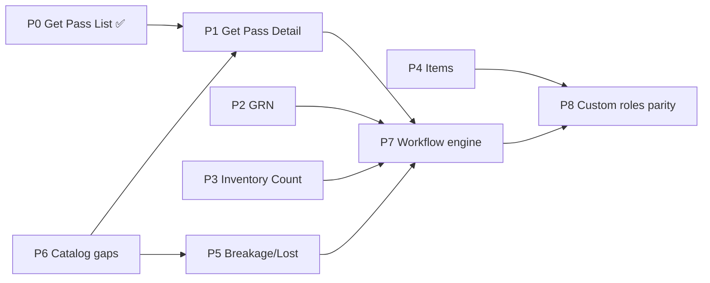

# ACC Operational Control Migration Program

| Field | Value |
|--------|--------|
| **Status** | Active — P0–P8 implemented (UAT review) |
| **Decision** | ACC = Single Source of Truth for operational control |
| **Type** | Long-term architectural migration (not ad-hoc fixes) |
| **Related** | `rbac-target-matrix/`, `workflow-step-permissions.js`, `catalog.constitution.js`, `WORKFLOW_MATRIX.md` |

---

## 1. Architectural decision (final)

**ACC is the sole source of operational control.**

Anything a user can **see** or **do** in day-to-day operations must be gated by:

```ts
hasPermission('CANONICAL_PERMISSION_CODE')
```

**Role names are not permissions.** They remain valid only for:

| Use | Examples | Keep role-based? |
|-----|----------|------------------|
| Identity | JWT `role`, membership, ACC assignment | Yes |
| Governance bypass | `SUPER_ADMIN`, `ORG_MANAGER` → `hasPermission` short-circuit | Yes |
| Scope / tenant context | `isParentOrganizationContext()`, org-wide list expansion | Yes |
| Platform boundaries | Super Admin portal, subscription bypass | Yes |
| Security shell UX | Minimal SECURITY nav (`SECURITY_NAV_ENTRIES`) | Yes |
| Dept Manager nav policy | Hidden paths (`DEPT_MANAGER_HIDDEN_NAV_PATHS`) | Yes |
| Support bypass | `isAdminBypass()` on workflow (ORG/SUPER only) | Yes |
| Dashboard layout profile | executive / operations / department / security **widgets only** | Yes (presentation) |

Everything else — screens, tabs, buttons, CRUD, workflow actions, reports, menu items, detail visibility, **custom roles** — must be **permission-driven**.

### Target model

```text
Role Names     = Identity + Governance + Scope
Permissions    = Operational Control
ACC            = Single Source of Truth
```

---

## 2. Current state (post-audit baseline)

| Layer | ACC-aligned? | Notes |
|-------|--------------|-------|
| Routes / sidebar | Mostly yes | `permissionGuard`, `navigation.service` → `hasPermission` |
| JWT effective permissions | Yes | ACC → `ur_*` → token |
| Feature UI (buttons/tabs) | Partial | ~18+ frontend `hasRole()` gates |
| Backend workflow engines | Partial | `assertCanActOnStatus`, `COST_REVIEW_ROLES`, step role matching |
| Custom roles (`{TENANT}__{ROLE}`) | Broken for ops | ACC grants permissions; `hasRole('COST_CONTROL')` always fails |

**Canonical permission resolver (already exists):**  
`OSE-backend/src/acc-authority/workflow-step-permissions.js` — extend usage to runtime enforcement, not only pipeline collectors.

---

## 3. Program phases

### Phase map

```text
P0 ✅ Get Pass List
P1 ✅ Get Pass Detail (+ backend approve gates)
P2 ✅ GRN review/post
P3 ✅ Inventory Count
P4 ✅ Items edit/delete
P5 ✅ Breakage / Lost tabs & actions
P6 ✅ Catalog gaps (Claims, Stock Report)
P7 ✅ Workflow engine (permission-first enforcement)
P8 ✅ Custom roles parity + lint/governance lock
```

Phases **P1–P6** may ship incrementally. **P7** is the backend consolidation that makes P8 durable. **P8** is the acceptance gate for “ACC = SSOT”.

---

## P0 ✅ — Get Pass List

**Status:** Complete.

| Item | Before | After |
|------|--------|-------|
| Incoming / Returns tabs | `hasRole(...)` | `hasPermission('GET_PASS_VIEW')` |
| HTML alignment | Unconditional `<nz-tab>` | `@if (canViewIncoming())`, `showListTabs()` |

**Files:**  
`OSE-Frontend/src/app/features/get-pass/get-pass-list/get-pass-list.component.ts`  
`OSE-Frontend/src/app/features/get-pass/get-pass-list/get-pass-list.component.html`

**Acceptance:** Any role (including `COST_CONTROL`, custom roles) with `GET_PASS_VIEW` from ACC sees Outgoing + Incoming + Returns.

---

## P1 — Get Pass Detail

**Goal:** Remove operational `hasRole()` from detail page; align FE + BE with `workflow-step-permissions.js`.

### Frontend — replace role gates

| Function | Current | Target permission |
|----------|---------|-------------------|
| `showPendingDeptActions()` | `DEPT_MANAGER` + mixed | `GET_PASS_APPROVE` (+ admin bypass) |
| `showCostControlVerifyActions()` | `COST_CONTROL` | `GET_PASS_APPROVE` |
| `showFinanceSignActions()` | `FINANCE_MANAGER` | `GET_PASS_APPROVE` |
| `showGmAuthorizeActions()` | `GENERAL_MANAGER` | `GET_PASS_APPROVE_FINAL` |
| `showSecurityApproveActions()` | `SECURITY` | `GET_PASS_APPROVE_FINAL` |
| `showSecurityClearanceApproveButton()` | `SECURITY` only | `GET_PASS_APPROVE_FINAL` |
| Return / destination flows | `DEPT_MANAGER`, `SECURITY` | `GET_PASS_CONFIRM_DESTINATION`, `GET_PASS_APPROVE_RETURN` |
| `canReturn()` etc. | already partial | keep / unify on permissions |

**File:** `OSE-Frontend/src/app/features/get-pass/get-pass-detail/get-pass-list.component.ts` (13+ `hasRole` call sites)

**Pattern:**

```ts
// Use resolveGetPassPermission(status, waitingForRole, options) parity on FE
// Shared util: import map from workflow-step-permissions (or FE mirror)
showCostControlVerifyActions(): boolean {
  return this.isAdminBypass() || this.auth.hasPermission('GET_PASS_APPROVE');
}
```

### Backend — replace `assertCanActOnStatus(role)`

| Current | Target |
|---------|--------|
| `getPass.service.js` → `STEP_ROLE[status]` + `role === required` | `requirePermission(resolveGetPassPermission(status, …))` on approve/reject routes |
| `assertCanActOnStatus(getPass.status, user.role)` | `assertUserHasStepPermission(user, status, context)` using JWT permissions |

**Files:**  
`OSE-backend/src/services/getPass.service.js`  
`OSE-backend/src/routes/getPass.routes.js` (approve/reject — today some lack explicit permission middleware)  
`OSE-backend/src/acc-authority/workflow-step-permissions.js`

### Out of scope (governance — keep)

- `isAdminBypass()` → ORG_MANAGER / SUPER_ADMIN
- `resolveOrgWideGetPassListContext` → ORG_MANAGER scope
- `getSubmitInitialWorkflow(role)` → workflow routing by submitter identity (P7 may refine)

### Acceptance criteria

- [ ] Custom role with `GET_PASS_APPROVE` sees Cost Control verify UI at `PENDING_COST_CONTROL`
- [ ] Custom role without permission does not — regardless of role name
- [ ] API approve at each step returns 403 without permission (not 500 role mismatch)
- [ ] Existing UAT roles behave identically when ACC grants match legacy matrix
- [ ] `npm run build` PASS; get-pass smoke tests PASS

---

## P2 — GRN

**Goal:** Cost review, finance post, storekeeper UX — all permission-driven. Remove `COST_REVIEW_ROLES` / `FINANCE_POST_ROLES`.

### Frontend

| File | Function | Target |
|------|----------|--------|
| `grn-list.component.ts:167` | `canShowReviewAction` | `GRN_MANAGE` |
| `grn-detail.component.ts:157` | `isFinanceApprover` | `GRN_MANAGE` |
| `grn-detail.component.ts:204` | `isGrnStatusReviewer` | `GRN_MANAGE` |
| `grn-detail.component.ts:176` | `isStorekeeper` | `GRN_MANAGE` (hide duplicate submit UX) |

**Note:** Segregation of duties moves from **role sets** to **ACC assignment policy** (who gets `GRN_MANAGE` at which property). Document in ACC matrix — do not reintroduce role checks.

### Backend

| File | Change |
|------|--------|
| `grn.service.js:252-354` | Replace `COST_REVIEW_ROLES.has(role)` / `FINANCE_POST_ROLES.has(role)` with permission checks |
| `grn.routes.js` | Ensure status transitions call permission resolver per target status |

**Proposed mapping (no new permissions):**

| Transition | Permission |
|------------|------------|
| VALIDATED → PENDING_FINANCE / REJECTED | `GRN_MANAGE` |
| PENDING_FINANCE → POSTED / REJECTED | `GRN_MANAGE` |
| Create / validate / resubmit | `GRN_MANAGE` (existing routes) |

If product requires **split** cost vs finance GRN permissions later, add `GRN_COST_REVIEW` / `GRN_FINANCE_POST` in P6 — not required for initial migration if `GRN_MANAGE` remains the ACC control knob.

### Acceptance criteria

- [ ] ACC grant/revoke `GRN_MANAGE` immediately toggles review + post UI and API
- [ ] Custom role with `GRN_MANAGE` can cost-review and finance-post (if ACC grants both transitions)
- [ ] ORG_MANAGER bypass unchanged

---

## P3 — Inventory Count

**Goal:** Approve, manage, workflow actions → permissions.

### Frontend

| File | Function | Target |
|------|----------|--------|
| `inventory-count-page.component.ts:519-526` | `canApproveSession` | `APPROVE_INVENTORY_COUNT` |
| `inventory-count-detail.component.ts:764-768` | `canManage()` | `STOCK_COUNT_MANAGE` only (remove role fallback) |

Use `resolveCountPermission(status)` from `workflow-step-permissions.js` for step-specific buttons.

### Backend

| File | Change |
|------|--------|
| `inventoryCount.service.js:114-124` | `assertCanActOnApprovalStep` → permission check via `resolveCountPermission` |
| `stockCount.service.js:271` | Replace `stepRoleCode !== user.role` with permission gate |

### Acceptance criteria

- [ ] Finance/GM approve buttons require `APPROVE_INVENTORY_COUNT`
- [ ] Counting/recount/reveal require `STOCK_COUNT_MANAGE`
- [ ] Custom roles work when ACC assigns permissions

---

## P4 — Items (Master Data)

**Goal:** Edit/delete → `BASIC_DATA_EDIT`.

| File | Change |
|------|--------|
| `items-list.component.ts:166-170` | `canEditItems`, `canDeleteItems` → `hasPermission('BASIC_DATA_EDIT')` |

Routes already guard create/edit with `BASIC_DATA_EDIT` — align list actions.

### Acceptance criteria

- [ ] ACC toggle `BASIC_DATA_EDIT` controls edit/delete buttons
- [ ] No `hasRole('ORG_MANAGER'|'FINANCE_MANAGER'|'GENERAL_MANAGER')` on items list

---

## P5 — Breakage / Lost

**Goal:** Remove role-based tab visibility and list-row action gates; use permissions + step resolver.

### Frontend

| Area | File | Change |
|------|------|--------|
| Status tabs | `returns-workflow.helpers.ts:401-418` | Replace `visibleReturnsWorkflowListStatusTabs(role)` with permission-based or **show all tabs user can filter** + API scope |
| List actions | `breakage-list`, `lost-items-list` | Keep `APPROVE_BREAKAGE` / `APPROVE_LOST`; replace `userCanActOnReturnsWorkflowListRow(role, …)` role leg with `userHasStepPermission(status, module)` |
| Detail | `breakage-detail`, `lost-items-detail` | Workflow advance: permission + step resolver (not role name) |

### Backend

| File | Change |
|------|--------|
| `breakage.service.js`, `lostItems.service.js` | Approve paths: `resolveBreakageLostPermission(module, status)` + JWT |
| `approvalChain.service.js:118-119` | Migrate to permission check (P7) |

### Acceptance criteria

- [ ] COST_CONTROL with `APPROVE_BREAKAGE` sees relevant tabs/actions without being named `COST_CONTROL`
- [ ] Tab set does not shrink/expand based on role string

---

## P6 — Catalog gaps (Claims + Stock Report)

**Goal:** Propose and add missing permissions so P1/P5 lanes are ACC-controllable.

### Proposed catalog additions

| Proposed code | Resource | Action | Name | Replaces |
|---------------|----------|--------|------|----------|
| `GET_PASS_VIEW_CLAIMS` | GET_PASS | VIEW_CLAIMS | View Get Pass Discrepancy Claims | `canViewClaims()` role list |
| `STOCK_REPORT_SUBMIT` | REPORTS | SUBMIT | Submit Stock Report | `canSubmitStockReport(role)` |
| `STOCK_REPORT_APPROVE` | REPORTS | APPROVE | Approve Stock Report | `canApproveStockReport(role)` |

**Optional (future GRN segregation):**

| Code | When |
|------|------|
| `GRN_COST_REVIEW` | If product splits cost vs finance GRN in ACC |
| `GRN_FINANCE_POST` | Same |

### Files to update when catalog changes

- `OSE-backend/src/acc-authority/catalog.constitution.js`
- `OSE-backend/src/acc-authority/base-role-permissions.js` (seed defaults only)
- ACC UI resource grouping (`user-rights.component.ts`)
- `docs/governance/rbac-target-matrix/2_PERMISSION_MATRIX.csv`
- Migration seed / `permissionVersion++`

### Acceptance criteria

- [ ] Claims tab gated by `GET_PASS_VIEW_CLAIMS` (or documented composite policy)
- [ ] Stock report submit/approve ACC-assignable
- [ ] New permissions appear in ACC matrix

---

## P7 — Workflow engine migration

**Goal:** Runtime enforcement uses **step permission**, not **step role name**.

### Principle

```ts
// Before
if (role === step.requiredRole.code) …

// After
if (userHasPermission(resolveStepPermission(module, status, context))) …
```

### Backend services (priority order)

1. `getPass.service.js` — `assertCanActOnStatus`, approve/reject handlers
2. `grn.service.js` — status patch
3. `inventoryCount.service.js`, `stockCount.service.js`
4. `breakage.service.js`, `lostItems.service.js`
5. `transfer.service.js`, `approvalChain.service.js`
6. `mapping.controller.js` — replace role list with permission

### Shared helper (new)

```js
// OSE-backend/src/acc-authority/step-permission-enforcement.js (proposed)
function userHasStepPermission(user, module, status, options) {
  const code = resolveWorkflowStepPermission(module, status, options);
  return hasJwtPermission(user, code);
}
```

Reuse exports from `workflow-step-permissions.js` — **do not duplicate maps**.

### Pipeline / collectors

Already derive `waitingForPermission` — verify list/detail/mine filters use same codes after P7.

### Acceptance criteria

- [ ] No operational `role === requiredRole` in approve paths (grep gate in CI)
- [ ] `workflow-step-permissions.js` is single map for pipeline + runtime
- [ ] Custom role passes approve when JWT contains step permission

---

## P8 — Custom roles parity + governance lock

**Goal:** `{TENANT}__{ROLE}` with ACC permissions behaves identically to standard roles.

### Frontend

- Remove all operational `hasRole('COST_CONTROL'|'FINANCE_MANAGER'|…)` (grep CI fail)
- Allowlist documented in `docs/governance/rbac-target-matrix/`

### Backend

- JWT permissions are authoritative; role string is identity only in workflow **routing** (submit initial step), not **authorization**

### CI / lint (proposed)

```text
# Fail build if new hasRole() in features/** except allowlist file
eslint rule or custom script: scripts/lint-no-operational-hasrole.js
```

### Acceptance criteria

- [ ] E2E: custom role `HOTEL__SENIOR_CC` granted `GET_PASS_APPROVE` + `GRN_MANAGE` passes P1+P2 UAT
- [ ] Grep: zero operational `hasRole` in `features/**` (except allowlist)
- [ ] ACC matrix documents which permissions control which UI surfaces

---

## 4. Role allowlist (must remain role-based)

Documented exceptions — **do not migrate to permissions:**

| Location | Reason |
|----------|--------|
| `auth.service.ts` ORG/SUPER `hasPermission` bypass | Governance |
| `navigation.service.ts` SECURITY nav shell | UX policy |
| `inventory-register-nav-permissions.ts` DEPT_MANAGER hidden paths | ACC governance strip |
| `isParentOrganizationContext()` | Tenant/org scope |
| `get-pass-detail` `isAdminBypass()` | Support |
| `dashboard` profile inference | Layout only |
| `requireSuperAdmin.js`, platform routes | Platform |
| `dashboard.controller.js` org summary membership | Org scope |
| `opening-balance-access.util.ts` | Governance setting |
| `settings-page` `isDeptManager()` profile field | Identity form UX |

---

## 5. Dependencies & sequencing



**Recommended delivery order:** P1 → P2 → P4 → P3 → P6 (catalog) → P5 → P7 → P8

P4 is low risk and can parallel P2. P6 should land before or with P1 Claims tab finalization.

---

## 6. Testing strategy (each phase)

| Layer | Action |
|-------|--------|
| Unit | Permission resolver tests per module |
| API | Role with permission succeeds; role without fails; custom role parity |
| UI | ACC grant/revoke → re-login → visibility changes without deploy |
| Regression | Standard roles match pre-migration behavior when ACC grants = legacy matrix |
| Smoke | Extend `smoke-*` scripts for custom role JWT fixtures |

**Mandatory re-login** after ACC matrix changes (JWT `permissions[]` refresh).

---

## 7. Rollout & communication

1. Publish this program to ops / ACC admins.
2. Per phase: update `2_PERMISSION_MATRIX.csv` + ACC help text.
3. UAT script per phase (see `PRE_WAVE2_RBAC_FIX.md` format).
4. No big-bang — ship phases behind normal release cadence.
5. Document ACC assignment guidance when segregation moves from code to matrix (especially GRN).

---

## 8. Success definition

Program complete when:

1. **Operational grep clean** — no `hasRole()` in feature UI except allowlist.
2. **ACC toggle test passes** — revoke permission in ACC → UI + API deny within re-login.
3. **Custom role parity** — `{TENANT}__{ROLE}` with grants equals standard role capabilities.
4. **Single resolver** — `workflow-step-permissions.js` drives pipeline, detail buttons, and API enforcement.
5. **Governance unchanged** — SUPER_ADMIN, ORG_MANAGER, scope, SECURITY shell, DEPT nav policy intact.

```text
Role Names     = Identity + Governance + Scope
Permissions    = Operational Control
ACC            = Single Source of Truth  ✓
```

---

## 9. Audit traceability index

| Audit finding | Phase |
|---------------|-------|
| Get Pass List Incoming/Returns | P0 ✅ |
| Get Pass Detail workflow buttons | P1 |
| Get Pass Claims tab | P1 + P6 |
| GRN review/post UI + `COST_REVIEW_ROLES` | P2 |
| Items edit/delete | P4 |
| Inventory Count approve/manage | P3 |
| Breakage/Lost tabs (`returns-workflow.helpers`) | P5 |
| Stock report submit/approve | P6 |
| `assertCanActOnStatus` / step role matching | P7 |
| Custom roles fail `hasRole` gates | P8 |
| `mapping.controller.js` role list | P7 |

---

## 10. Out of scope (explicit)

- Redesigning ACC UI
- Changing identity / membership model
- Removing ORG_MANAGER or SUPER_ADMIN bypasses
- Changing scope rules (`scope.service.js`, department/location filters)
- Dashboard widget **layout** profile (role-based presentation stays)
- Creating new workflow steps or business statuses

---

## Part II — ACC Runtime Program (P9–P18) ✅

**Status:** Complete — ACC is the sole runtime SSOT for workflows, permissions, policies, and scope assignments.

### Phase map

```text
P9  ✅ Workflow Runtime Foundation (published chain resolver, version pinning)
P10 ✅ Dual-Gate Enforcement (step role AND permission)
P11 ✅ Cutover Wave 1 — Breakage, Lost, Transfer
P12 ✅ Cutover Wave 2 — Get Pass, GRN
P13 ✅ Cutover Wave 3 — Stock Count, Stock Report, Requisition
P14 ✅ Advanced Policies Runtime (enforce under hard cutover)
P15 ✅ Scope & Assignments Runtime (UR assignments primary)
P16 ✅ ACC-native Feature Flags UI (System → Runtime tab)
P17 ✅ Legacy Workflow Engine Retirement
P18 ✅ Complete Acceptance (verify-acc-p18-complete.js)
```

### Runtime architecture (final)

```text
Workflow Builder → Published Version → acc-workflow-runtime.service.js
                                              ↓
                         Dual Gate: assertStepRoleMatch AND assertUserHasPermission
User Rights → JWT permissions ─────────────────┘

Advanced Policies → policy-enforcement-pilot (enforce when ACC_HARD_CUTOVER)
Scope → ur_user_assignments primary when ACC_HARD_CUTOVER
```

### Cutover modules (ACC-only, no legacy fallback)

| Module | Wave |
|--------|------|
| BREAKAGE (incl. LOST) | P11 |
| TRANSFER | P11 |
| GET_PASS | P12 |
| GRN | P12 |
| STOCK_COUNT | P13 |
| STOCK_REPORT | P13 |
| REQUISITION | P13 |

### Verification

```bash
cd OSE-backend
node scripts/verify-acc-p18-complete.js
```

### Emergency rollback (env)

| Flag | Effect |
|------|--------|
| `ACC_HARD_CUTOVER=false` | Disables default enforce posture |
| `ACC_ENFORCE_WORKFLOWS=false` | Legacy workflow fallback for non-cutover paths |
| `ACC_WORKFLOW_LEGACY_RETIRED=false` | Re-enable transitional legacy runtime |
| `USE_NEW_POLICY_ENGINE=false` | Scope falls back to role defaults |

Governance allowlist (unchanged): ORG_MANAGER/SUPER_ADMIN permission bypass, SECURITY nav shell, DEPT_MANAGER nav policy.

---

## Part III — P19→P30 ZERO LEGACY (2026-06-22)

**Decision:** ACC is the **only** operational controller. No permanent ACC+legacy coexistence.

| Phase | Deliverable | Status |
|-------|-------------|--------|
| P19 | `AccRuntimeSetting` DB SSOT + `ensureAccRuntimeConfigLoaded` on startup + `/api/acc/system/runtime-settings` | Done |
| P20 | `permissionId` + `statusKey` on workflow steps; step resolver service | Done |
| P21 | `acc-catalog.service.js` (UrPermission CRUD stub) | Done |
| P22 | GRN `ApprovalRequest` + dual gate + pinned `accWorkflowVersionId` | Done |
| P23 | Requisition full ACC runtime + controller passes `req.user` | Done |
| P24 | Get Pass approve/reject from pinned version only | Done |
| P25 | `acc-policy-runtime.service.js` field security on payloads | Stub |
| P26 | Scope zero legacy (`ROLE_SCOPE_DEFAULTS` fallback removed) | Done |
| P27 | Frontend zero operational `hasRole()` | Done |
| P28 | Pipeline/PDF/reports from ACC chains only | Done |
| P29 | `acc-workflow-legacy-chains.js` demolished; runtime ACC-only | Done |
| P30 | `verify-acc-p30-zero-legacy.js` | Done |

### Verification

```bash
cd OSE-backend
node scripts/verify-acc-p26-p28-zero-legacy-final.js
```

### Runtime flags (DB — edit via ACC System API)

| Key | Default (zero legacy) |
|-----|------------------------|
| `accZeroLegacy` | `true` |
| `accWorkflowLegacyRetired` | `true` |
| `accHardCutover` | `true` |
| `accLegacyDualWrite` | `false` |

Env vars are **bootstrap-only** when DB is empty or `ACC_BOOTSTRAP_ONLY=true`.

---

*Last updated: 2026-06-22 — P0–P30 FINAL ZERO LEGACY complete.*
